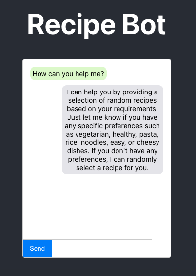
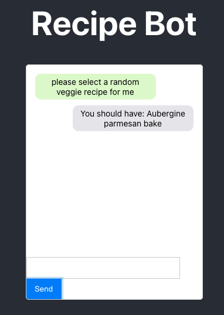
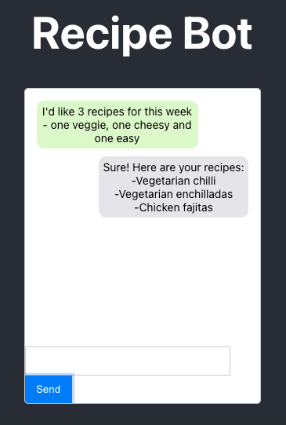

# Recipe Bot

Sometimes, I struggle to decide what to have for dinner.

Recipe Bot uses the uses the OpenAI API in conjunction with a database of my favourite weeknight recipes to help with meal planning.

## Examples

You can see the `prompt engineering` in the flask backend (`app.py`).

## How to run?
You will need your own OpenAI API Key (and some credit) in order to run the bot. 

This bot is made up of a React frontend and a Flask backend.

Instructions on how to run the bot locally can be found at `dev_instructions.md`.